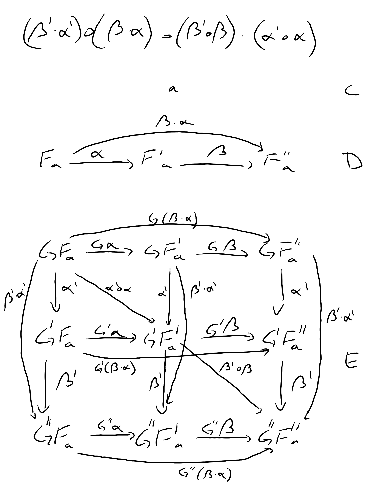

# Chapter 10 - Natural Transformations

## 1. Define a natural transformation from the ```Maybe``` functor to the list functor. Prove the naturality condition for it.

```
alpha :: Maybe a -> [a]
alpha Nothing = []
alpha (Just x) = [x]
```

The naturality condition states:
```
fmap f . alpha = alpha . fmap f 
```

We need to prove this for two cases: ```Nothing``` and ```Just x```.

First ```Nothing```:
```
(fmap f . alpha) Nothing
= fmap f (alpha Nothing)
= fmap f []
= []

(alpha . fmap f) Nothing
= alpha (fmap f Nothing)
= alpha Nothing
= []
```

Then ```Just x```:
```
(fmap f . alpha) (Just x)
= fmap f (alpha (Just x))
= fmap f [x]
= [f x]

(alpha . fmap f) (Just x)
= alpha (fmap f (Just x))
= alpha (Just (f x))
= [f x]
```

These proofs assume the standard implementation of ```fmap``` for lists and ```Maybe```:
```
fmap f [] = []
fmap f (x:xs) = f x : fmap f xs
fmap f Nothing = Nothing
fmap f (Just x) = Just (f x)
```

## 2. Define at least two different natural transformations between ```Reader ()``` and the list functor. How many different lists of ```()``` are there?

This is similar to the transformation ```Reader () a -> Maybe a``` given in the text, but for ```[a]``` we could potentially create an infinite number of transformations by simply repeating the result of the reader call:

```
alpha1 :: Reader () a -> [a]
alpha1 _ = []

alpha2 :: Reader () a -> [a]
alpha2 (Reader x) = [x ()]

alpha3 :: Reader () a -> [a]
alpha3 (Reader x) = [x (), x ()]
```

## 3. Continue the previous exercise with ```Reader Bool``` and ```Maybe```.

Again, this is similar to the transformation ```Reader () a -> Maybe a```. We can still choose to ignore the value and map everything to ```Nothing```:

```
alpha :: Reader Bool a -> Maybe a
alpha _ = Nothing
```

Similar to how a ```Reader () a```'s are functions that pick a single element from ```a```, a ```Reader Bool a``` is a function that picks two elements, which we can retrieve by passing ```True``` or ```False``` to it. This means we have two options for the ```Just``` case, bringing the total to 3 possible natural transformations:

```
alphaT :: Reader Bool a -> Maybe a
alphaT (Reader x) = Just (x True)

alphaF :: Reader Bool a -> Maybe a
alphaF (Reader x) = Just (x True)
```

## 4. Show that horizontal composition of natural transformation satisfies the naturality condition (hint: use components). It's a good exercise in diagram chasing.

We have two functors from category ```C``` to ```D```: ```F``` and ```F'```  with natural transformation ```α :: F -> F'```, and two functors from category ```D``` to ```E```: ```G``` and ```G'``` with natural transformation ```β :: G -> G'```.

Functors ```F``` and ```G``` compose since the target category of ```F``` is the source category of = ```G```, but ```α``` and ```β``` are collections of morphisms in different categories, ```D``` and ```E``` respectively, so they don't compose directly (i.e. vertically).

Horizontal composition of ```α``` and ```β``` defines ```γ :: G ◦ F -> G' ◦ F'```. Note that ```γ``` will be a morphism in ```E```, and that ```α```, being a morphism in ```D``` can be lifted into ```E``` using ```G``` or ```G'```:
```
G α :: G . F -> G . F'
G' α :: G' . F -> G' . F'
```

We have two options for ```γ```:
```γ = β ◦ α
= β . (G α)
= (G' α) . β
```

The naturality condition states:
```
α_b . F f = F' f . α_a
```

Rewritten for this case this becomes:

```
(G' . F') f . γ_a = γ_b . (G . F) f
:: GFa -> G'F'b
```

Using equational reasoning:

```
γ_b . (G . F) f
= // definition of γ
β_F'b . (G α_b) . (G . F) f
= // naturality of α
β_F'b . (G . F') f . (G α_a)
= // naturality of β
(G' . F') f . β_F'a . (G α_a)
= // definition of γ
(G' . F') f . γ_a
```

## 5. Write a short essay about how you may enjoy writing down the evident diagrams needed to prove the interchange law.

Assume three functors ```F```, ```F'``` and ```F''``` from ```C``` to ```D```, and three functors ```G```, ```G'``` and ```G''``` from ```D``` to ```E```.

Natural transformations ```α``` and ```β``` are morphisms in D:
```
α :: F a -> F' a
β :: F' a -> F'' a
```

Natural transformations ```α'``` and ```β'``` are morphisms in E:
```
α' :: G a -> G' a
β' :: G' a -> G'' a
```

The interchange law states:
```
(β' . α') ◦ (β . α) = (β' ◦ β) . (α' ◦ α)
```

From the diagram it should be clear both sides of the equation form a morphism from ```GFa``` to ```G''F''a```, with the left hand size representing the path through ```GF''a```, and the right hand side the diagonal through ```G'F'a```.



## 6. Create a few test cases for the opposite naturality condition of transformations between different ```Op``` functors. Here's one choice:

```
op :: Op Bool Int
op = Op (\x -> x > 0)
```
and
```
f :: String -> Int
f x = read x
```

The following two examples both lift a function ```f``` or ```f'``` using contramap to change the second type parameter (```Op a Int -> Op a String``` and ```Op a String -> Op a Int``` respectively), and both define a natural transformation, ```alpha``` and ```alpha'```, to change the first parameter.

The naturality condition states:
```
α . fmap f = fmap f . α
```

For contravariant functors this becomes:
```
α . contramap f = contramap f . α
```

So the functions alphaMap and mapAlpha should behave the same: 

```
op :: Op Bool Int
op = Op (0 <)
f :: String -> Int
f x = read x
alpha :: (Op Bool a) -> (Op String a)
alpha (Op x) = Op (show . x)

op' :: Op Int String
op' = Op length
f' :: Int -> String
f' = show
alpha' :: (Op Int a) -> (Op Double a)
alpha' (Op x) = Op (sqrt . fromIntegral . x)

main :: IO ()
main = do
    -- alphaMap :: String -> String
    let (Op alphaMap) = (alpha . contramap f) op
    let (Op mapAlpha) = (contramap f . alpha) op
    print (alphaMap "1")
    print (mapAlpha "1")
    print (alphaMap "-42")
    print (mapAlpha "-42")
    -- alphaMap :: Int -> Double
    let (Op alphaMap') = (alpha' . contramap f') op'
    let (Op mapAlpha') = (contramap f' . alpha') op'
    print (alphaMap' 1)
    print (mapAlpha' 1)
    print (alphaMap' 42)
    print (mapAlpha' 42)
```